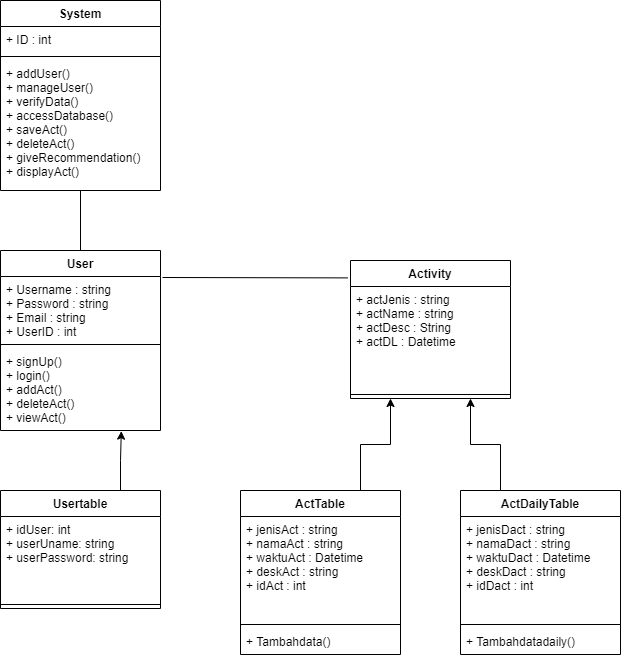
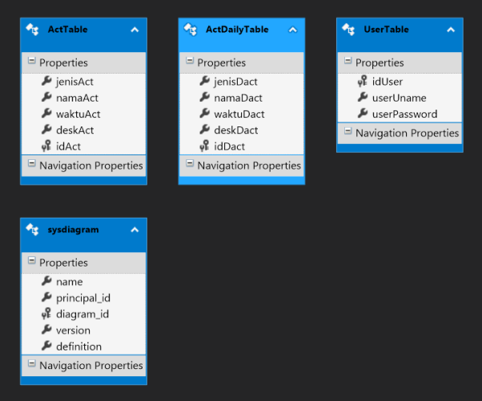

# Skhedule

Proyek Aplikasi ini merupakan aplikasi dekstop yang dapat digunakan untuk membantu mengorganisir jadwal kegiatan. Aplikasi ini terdiri dari user dan sistem. User adalah pihak pemakai aplikasi yang dapat menggunakan aplikasi untuk menambahkan, mengedit, dan menghapus aktivitas. Sedangkan sistem adalah pihak dari aplikasi itu sendiri yang memiliki peran untuk menyimpan data user, menyimpan  dan mengelola aktivitas user serta memberikan rekomendasi pilihan jadwal yang sesuai bagi user.  
Domain Diagram 

Berikut ini adalah tabel UML dari program yang kami buat 
 
Terdapat 3 tabel pada UML program yaitu ActTable, ActDailyTable, dan UserTable. ActTable merupakan tabel untuk menyimpan data dari user yang berupa jadwal yang hanya sekali digunakan. Adapun data yang disimpan di tabel ini yaitu jenis kegiatan(berupa kegiatan yang hanya sekali dilakukan), nama kegiatan, waktu kegiatan(berupa tanggal kegiatan), dan deskripsi kegiatan. ActDailyTable merupakan tabel yang digunakan untuk menyimpan data jadwal harian user. Data-data yang disimpan yaitu jenis kegiatan(berupa kegiatan yang dilakukan setiap hari tertentu), nama kegiatan, hari kegiatan, dan deskripsi kegiatan. Yang terakhir yaitu UserTable. Tabel ini menyimpan data username dan password dari akun user. Pada setiap tabel diberikan id supaya tidak terjadi error dalam pemanggilan tabel. 
